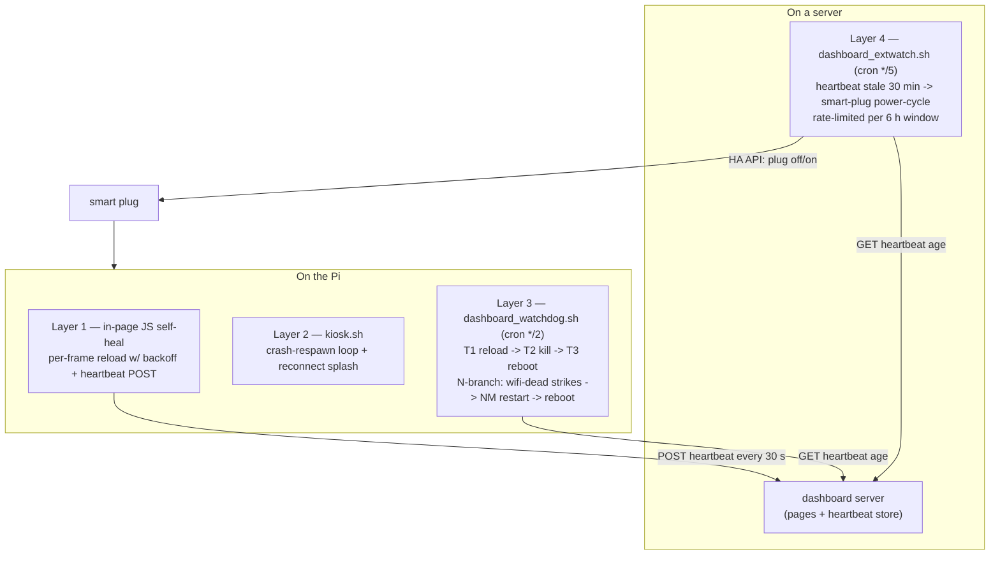

# pi-kiosk-survival-kit

Four independent watchdog layers that keep a Raspberry Pi wall-dashboard alive with zero
human touch — each layer covering a failure class the layer below it is structurally
blind to. Plus byte-exact deploy verification and pull-based remote reboot control.

## The war story

2026-08-05, early morning: a Pi 3B wall board rebooted and came back up **with its WiFi
radio dead**. No SSH, no ping, nothing on the network — historically that meant "board is
dark until someone notices and pulls the plug", which in this house had previously meant
8-hour and even 36-hour blind outages.

This time the log told a different story. Layer 3 (the on-Pi watchdog, running from cron
every 2 minutes) couldn't reach the heartbeat server, checked `wlan0`, found it
*missing*, and started counting strikes. At strike 3 it restarted NetworkManager. Still
dead — the radio needed its firmware reloaded, which no daemon restart can do. At strike
6 it invoked its guarded self-reboot. The board came back with a working radio, the kiosk
respawned, the page started beating, and every layer stood down.

**Nobody touched anything.** The whole event exists only as a syslog trail. That is what
these scripts are for.

## The four layers



The design rule: **every layer watches a signal the layer below cannot fake and covers a
failure the layer below cannot fix.**

### Layer 1 — in-page self-heal (`extras/example-dashboard.html` shows the pattern)

Catches: a *single* iframe/endpoint failing while the page itself is healthy. A transient
server blip at load time used to break all frames at once with no recovery until the next
meta-refresh. The in-page watchdog reloads failed frames with exponential backoff
(30 s → 5 min cap), and only allows a whole-page reload when *every* frame is broken,
≥5 min apart, max 3 times — on a memory-tight Pi, a reload loop is worse than the outage.
It also POSTs the heartbeat every 30 s — the signal every higher layer trusts, because
it can only exist if the page JS is actually running.

**Blind to:** its own death. A wedged renderer cannot run the JS that would heal it.

### Layer 2 — `kiosk.sh` (crash-respawn + splash)

Catches: Chromium *exiting* — crash, OOM-kill, or layer 3's `pkill`. An infinite loop
relaunches the browser 2 s later, scrubbing the "restore session?" crash flags first.
And if the dashboard server is unreachable at (re)launch, it loads a local data-URL
"Reconnecting…" splash that polls the endpoint every 5 s and replaces itself with the
real page the moment the server answers — from the source, dated 2026-07-31:

> "a kiosk respawn during a Node-RED outage used to strand the board on a Chromium error
> page no watchdog tier could fix (the watchdog correctly skips while the heartbeat
> endpoint is down)."

**Blind to:** a browser that is alive but frozen. A wedged renderer never exits, so the
respawn loop never fires.

### Layer 3 — `dashboard_watchdog.sh` (the workhorse)

Catches: the **wedged renderer** — Chromium alive, page JS frozen, heartbeat stale.
Detection is the heartbeat *age*, read from the server. Three escalation tiers, because a
1 GB board leaks over multi-day uptime and a soft reload isn't always enough:

- **T1** stale → `xdotool` ctrl+r (browser-level reload works even when page JS is frozen)
- **T2** still stale → `pkill -9 chromium` (layer 2 respawns it fresh in ~2 s)
- **T3** still stale ~10 min after T2 → guarded `sudo reboot`, rate-limited by a cooldown

Plus the **N-branch**, the part that saved the 2026-08-05 morning: when the heartbeat
endpoint is *unreachable*, "do nothing" is only correct if the network is actually fine
(backend outage — rebooting the Pi can't fix the server). So unreachable splits on
`wlan0` state, and — the hard-won part — **NetworkManager's word is not trusted**. From
the source:

> "2026-08-02 LESSON: NM can report wlan0 'connected' while the client is gone from the
> AP (assoc stale, no traffic passes) — the board sat dark 8 h because this branch
> abstained on NM's word alone."

"Connected" now requires a passing **second-opinion probe**: gateway ping (same-subnet
ICMP is fine) *or* a TCP connect to a DNS server's :53 on another subnet — **never bare
ping cross-subnet**, because segmented networks routinely filter ICMP between VLANs and
a filtered ping reads exactly like a dead network (that false signal is what got the
previous external watchdog disabled). Both probes failing while NM says "connected"
⇒ net-dead ⇒ N-branch: 3 strikes → restart NetworkManager, 6 strikes → guarded reboot
(a reboot reloads the `brcmfmac` WiFi firmware, which an NM restart cannot).

Also deliberate, from the header: the script is **not** `set -e` —

> "this script's normal flow runs commands that return non-zero (curl timing out is the
> trigger; pkill returns 1 when nothing matches). set -e would exit exactly when it
> should be recovering."

**Blind to:** a board that is beyond self-help — hard freeze, cron dead, SD card wedged,
kernel panic. No on-board script survives all of those.

### Layer 4 — `dashboard_extwatch.sh` (off-Pi power-cycler)

Catches: everything above. Runs on a server, reads the same heartbeat age, and if a board
has been dark past the point where layer 3 must have played its whole hand (30 min), it
power-cycles the board's smart plug via Home Assistant — off, 8 s, on. Judgement details:

- **Heartbeat, not ping.** The trigger is client-truth (the page's own beat). The
  previous external layer triggered on cross-VLAN ping and was disabled for false alarms;
  its absence is why one board sat dark for 8 hours.
- **Rate-limited:** max 2 cycles per 6 h window per board, minimum 15 min between cycles;
  when exhausted it alerts instead. Guards the SD card and prevents a cycle-loop on a
  board that can't boot (dead card, dead PSU).
- **Abstains** when the heartbeat server itself is down (no board can be judged), and
  falls back to a TCP :22 probe when the server restarted and has no beat on record.
- **Self-monitored:** pushes to an Uptime-Kuma-style push monitor every healthy run, so
  the watchdog's own death raises an alert.
- Boards without a plug still get **alert-only** coverage — the comment block preserves
  the incident where a board left out of the table stayed dark 36 h while the page
  monitor stayed green.

**Blind to:** nothing short of the power grid — which is the point of being layer 4.

## The supporting cast

- **`canary_baseline.sh` — deploy verification in bytes, not 200s.** Captures the exact
  payload byte-count of every endpoint a fragile board loads, plus its memory/swap/
  thermal state over SSH. Run before and after a change; **any** delta is
  stop-the-line. Why not status codes or timing? Per-board content gating fails
  *silently* (a missed gate returns 200 with the wrong bytes), and — from the source —
  under-voltage causes ARM frequency scaling, so "timing lies" on a browning-out board.
  Bytes are clock-independent truth.
- **Nonce-based reboot/halt pull-control** (in `firstrun-kiosk.sh`'s `screen_poll.sh`):
  remote reboot with no inbound port on the board. The board polls a monotonic nonce and
  acts on **change**, seeding on first read — acting on the *value* would re-execute the
  reboot that preceded the boot, i.e. a reboot loop.
- **`dashboard_output.sh` + `dashboard_display_watch.sh`** — display self-config: output
  detection that falls back to the first HDMI connector (X starting while the panel
  sleeps reads *every* connector as disconnected, and a connected-only match makes a
  portrait board come up landscape), a loop that re-applies the mode when the panel
  returns (xrandr cannot set a mode on a disconnected output), rotation self-heal, and
  full-range RGB re-assertion on KMS boards.
- **`firstrun-kiosk.sh`** — unattended first-boot provisioning that wires all of the
  above into a fresh Pi OS Lite card, with its own scar tissue: wait for **clock sync**
  before apt (a Pi has no RTC; a stale clock fails repo signature checks *and* 404s the
  pool), `apt-get update` must succeed or no done-flag, persistent-but-capped journald
  via an `/etc` drop-in (Pi OS forces volatile via a vendor drop-in, and volatile
  journald destroyed the evidence in two freeze investigations), WiFi powersave off by
  resolving the *real* NM connection name, and verify-the-stack-before-done-flag so a
  half-configured board retries instead of bricking politely.

## Quickstart

```bash
# On the Pi (or bake it in with firstrun-kiosk.sh at flash time):
export DASHBOARD_SERVER=http://your-server:1880       # see .env.example
cp kiosk.sh dashboard_watchdog.sh dashboard_output.sh dashboard_display_watch.sh /home/pi/
crontab -l | { cat; echo "*/2 * * * * /home/pi/dashboard_watchdog.sh"; } | crontab -

# Your dashboard page: add the heartbeat POST + fitGuard (see extras/example-dashboard.html)

# Server side: two endpoints
#   POST /endpoint/dashboard-heartbeat   -> store now()
#   GET  /endpoint/dashboard-heartbeat   -> {"ago_s": <seconds since last beat>}

# On an always-on box (layer 4):
cp dashboard_extwatch.sh /usr/local/bin/
# edit the BOARDS table + point ENV_FILE at a file exporting HA_TOKEN
crontab -l | { cat; echo "*/5 * * * * /usr/local/bin/dashboard_extwatch.sh"; } | crontab -

# Before/after any change to a fragile board:
./canary_baseline.sh > before.txt   # ...deploy... ; ./canary_baseline.sh > after.txt
diff before.txt after.txt           # ANY delta is stop-the-line
```

## Design decisions — and why

- **Independent layers, not one smart daemon.** Every failure here was discovered by a
  previous layer *not* covering it. A single supervisor is a single point of blindness;
  four dumb layers with disjoint vantage points caught a dead radio, a wedged renderer,
  a stranded error page, and a hard freeze — each within minutes.
- **The heartbeat is the only trusted signal.** Process-alive, port-open, ping, and
  NetworkManager state have all produced false readings in this fleet's history. "The
  page's JS posted within 120 s" is the one proxy that implies everything upstream works.
- **Second opinions before destructive action.** NM state gets a traffic probe; a missing
  heartbeat record gets a TCP :22 tiebreaker; T3/N2 reboots sit behind cooldowns; plug
  cycles are windowed. Every escalation is cheap to be wrong about *once* and guarded
  against being wrong repeatedly.
- **`flock` on every cron entrant.** A hung curl plus a */2 cron otherwise stacks
  instances.
- **Log context on every action.** The watchdog stamps SoC temperature + throttle flags
  on each event, because a hot, throttled SoC stretches JS execution and masquerades as
  a wedge — the log alone can rule that in or out afterwards.

## Limitations

- The heartbeat server is a trusted dependency: layers 3 and 4 both correctly *abstain*
  when it is down, which means a simultaneous server-plus-board failure needs a human
  (by design — rebooting Pis can't fix a server).
- Layer 4 requires Home Assistant (or any HTTP API you can adapt `ha_call` to) and a
  smart plug per board you want auto-cycled; plugless boards get alert-only coverage.
- The N-branch assumes `wlan0` and NetworkManager (stock Pi OS). Ethernet-attached or
  `wpa_supplicant`-managed boards need the `wifi_state()` function adapted.
- `xdotool`-based T1 assumes X11; under Wayland/labwc use a different reload mechanism
  (or rely on T2's kill+respawn, which is compositor-agnostic).
- Power-cycling is inherently SD-card-hostile; the rate limits reduce, not eliminate,
  the risk. Use decent cards and the tmpfs-profile mitigation in `firstrun-kiosk.sh`.
- The scripts self-heal one *board* at a time; they do not coordinate. A fleet-wide
  server outage produces N boards politely abstaining, which is correct but silent —
  monitor the server separately.

## License

MIT — see [LICENSE](LICENSE).
